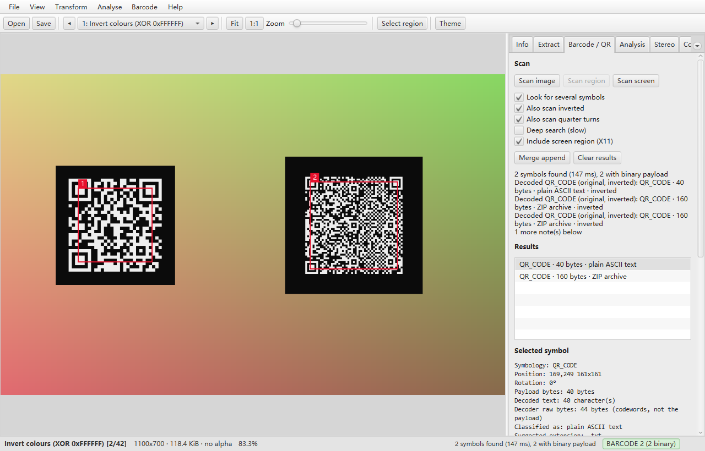

# StegSolver

[](https://github.com/jacek4yang/stegsolver/actions/workflows/ci.yml)
[](https://github.com/jacek4yang/stegsolver/actions/workflows/codeql.yml)
[](https://github.com/jacek4yang/stegsolver/actions/workflows/package.yml)
[](LICENSE)
[](https://adoptium.net/temurin/releases/?version=21)

A steganography analysis tool for images, rebuilt as a modern Java 21 / JavaFX desktop
application.

StegSolver steps through bit plane transforms, extracts hidden data, solves stereograms, combines
images, browses animation frames, analyses image file structure and recovers barcodes and QR codes
as **payloads** — bytes, not strings.

It is a rebuild of the original [StegSolve](https://github.com/caesum/stegsolve) by Caesum, keeping
its transform numbering and its extraction conventions so that existing habits, notes and
walkthroughs still apply.



## Highlights

* **All 42 original transforms** in the original order (bit planes 7..0 of alpha, red, green and
  blue, inversion, full channels, three random colour maps, gray pixel highlighting), with instant
  previous/next navigation and keyboard shortcuts.
* **Binary safe barcode and QR handling**: whole image, dragged region or X11 screen region scans;
  multiple symbols per image; QR Structured Append; `TRY_HARDER` plus inverted, rotated, rescaled and
  alternate binarizer fallbacks; explicit separation of payload bytes, decoded text and ZXing raw
  codewords; payload classification with correct suggested file extensions; bounded hex/ASCII
  preview; `Save Payload`, `Save Text`, `Copy Text`, `Copy Hex` and metadata. Decoded payloads are
  never opened, extracted or executed.
* **Data extraction** with the original mask, traversal, bit order and channel order options, plus
  bit inversion and a bounded preview that cannot flood the UI.
* **Structural file analysis** for PNG, JPEG, GIF and BMP with strict bounds checking: chunk lists,
  CRCs, palettes, comments, JPEG segments and, most importantly, data appended after the end of the
  image.
* **Tools**: stereogram solver with automatic offset search, 13 mode image combiner, frame browser
  with lazy loading, pixel inspector, image region selection and saved or copied results.
* **Responsive on large images**: bulk pixel arrays, bounded transform and render caches, background
  computation that discards superseded work.
* **Dark, light and system themes**, HiDPI aware, no Swing anywhere.

## Download and start

Download the Windows x64 ZIP or Linux x64 tar.gz from [Releases](https://github.com/jacek4yang/stegsolver/releases).
Extract the whole archive. On Windows, run `StegSolver/StegSolver.exe`; on Linux Mint Cinnamon X11,
run `StegSolver/bin/StegSolver`. Java 21 and JavaFX are included. Keep the runtime and app folders
beside the launcher. The portable builds are unsigned.

## Building requirements

* **JDK 21** (Temurin, Microsoft or any other build) — `java`, `jlink` and `jpackage` on `PATH`.
* **Maven 3.9+** for building from source.
* No JavaFX installation is needed: Maven resolves the platform specific JavaFX artifacts, and the
  packaged applications bundle a runtime image that contains them.

## Running

```bash
mvn -B -ntp compile                     # compile
scripts/run.sh                          # start the application
scripts/run.sh suspicious.png           # start with an image open
scripts/run.ps1 suspicious.png          # Windows equivalent
```

Interactive features worth knowing about:

| Action | Shortcut |
| --- | --- |
| Previous / next transform | `←` / `→` |
| Previous / next transform inside the current group | `↑` / `↓` |
| Open an image | `Ctrl+O` |
| Save the displayed image | `Ctrl+S` |
| Copy the displayed image | `Ctrl+C` |
| Scan the displayed image for barcodes | `Ctrl+B` |
| Scan the selected region | `Ctrl+Shift+B` |
| Fit to window / actual size | `Ctrl+0` / `Ctrl+1` |
| Zoom in / out | `Ctrl` `+` / `Ctrl` `-` |
| Show or hide the tool dock | `Ctrl+T` |
| Pan | drag with the left or middle mouse button |
| Zoom at the cursor | mouse wheel |
| Select a region | enable *Select region*, then drag |
| Reload the open image | `F5` |
| Full screen | `F11` |

## Testing and benchmarks

```bash
mvn -B -ntp verify                              # unit and integration tests
mvn -B -ntp -Pself-test exec:exec               # run every engine layer once, no display needed
mvn -B -ntp -Pself-test exec:exec -q            # same, quiet output
scripts/bench.sh                                # JMH benchmarks (see src/bench/java for the list)
mvn -B -ntp -Pbench test-compile exec:exec -Dbench.include=TransformBenchmark -Dbench.size=4096
```

The self test is the fastest way to check that a checkout (or a packaged build, see
`--self-test` under [Packaging](#packaging)) actually works: it runs the transform catalog, the bulk
pixel operations, the extraction, the stereogram solver, all 13 combine modes, the barcode scanner, the
file analysis and the lazy frame reader in one go and fails the build if any layer fails.

The test suite includes a legacy parity oracle: `LegacyReference` (test sources) transcribes the
original StegSolve algorithms, and every transform, combine mode, stereogram offset and extraction
option combination is compared against it byte for byte.

## Packaging

Both scripts produce a self contained application (Java 21 runtime + JavaFX inside it).
Linux needs the GTK 3/X11 desktop libraries supplied by Linux Mint. Ready-to-run builds can be taken from the artifacts of the
[Package](../../actions/workflows/package.yml) workflow. Main and tag builds run tests and verify
both platforms; releases are published only after the matching CI and package runs succeed:

```bash
packaging/package-linux.sh                 # Linux Mint / Debian: app-image by default
packaging/package-linux.sh --type deb      # .deb installer (needs fakeroot + dpkg)
```

```powershell
powershell -ExecutionPolicy Bypass -File packaging\package-windows.ps1
powershell -ExecutionPolicy Bypass -File packaging\package-windows.ps1 -Type msi   # needs WiX
```

Details, including why `jlink` works with JavaFX and ZXing, are in
[docs/packaging.md](docs/packaging.md).

## Documentation

* [docs/release-audit.md](docs/release-audit.md) ? verification, performance and practical limits.
* [docs/architecture.md](docs/architecture.md) — module layout, threading, design decisions.
* [docs/legacy-parity.md](docs/legacy-parity.md) — what was preserved, what changed and why.
* [docs/packaging.md](docs/packaging.md) — jlink/jpackage, targets and limitations.
* [CONTRIBUTING.md](CONTRIBUTING.md) — branches, commits, tests.

## Platform support

* **Windows 11** — primary target.
* **Linux Mint (Cinnamon), X11** — primary target. Screen region capture requires X11.
* Wayland is not supported for screen region capture (the compositor does not expose other windows'
  pixels); the application says so instead of returning a black image. Everything else works.

## Security

StegSolver is an analysis tool for untrusted data. Decoded barcode and QR payloads can be anything,
including archives and executables. The application therefore:

* never executes, opens, unpacks or extracts a decoded payload,
* labels every payload with its detected type and warns when it is an archive, document or
  executable,
* saves payloads byte exactly and only where you explicitly ask.

Malformed input is a first class concern rather than an afterthought: every parser reads through a
bounds-checked accessor, and the test suite truncates each supported format at every length, corrupts
single bytes and feeds random data behind valid signatures. See [SECURITY.md](SECURITY.md) for the
threat model and for how to report a vulnerability privately (please do not open a public issue for a
crash on a malformed file).

## License

MIT — see [LICENSE](LICENSE). The original StegSolve by Caesum is MIT licensed as well; its
algorithmic behaviour (transform numbering, extraction conventions, combine modes) is deliberately
preserved, and the migration is documented in [docs/legacy-parity.md](docs/legacy-parity.md).
